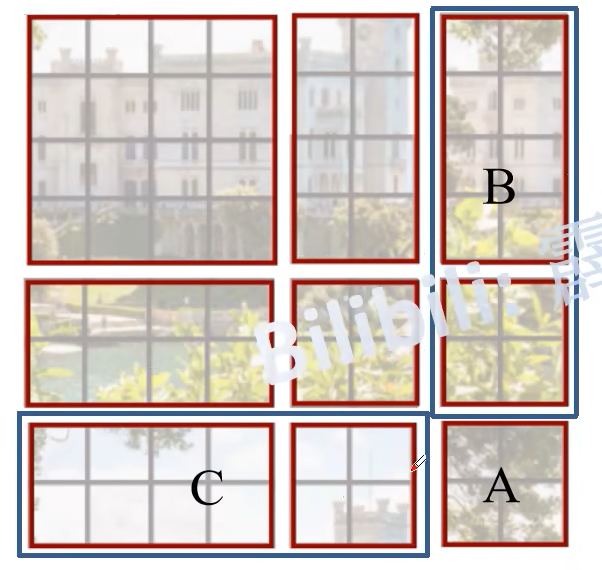
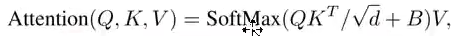

# SWIN FORMER

## 理论


**为什么将图片分批导入而不是逐像素点导入：**在某些视觉任务中，并不是所有的局部区域都对全局理解至关重要。某些局部区域的特征可能对整体识别影响不大，因此全局自注意力可能会引入不必要的计算

patch partition:进行图片的分批，以4x4大小的卷积核进行切割。将原图像改为H/2,W/2,channles*4的大小，依旧是在通道方向上将图片进行叠加

**patch merdding**:像卷积核一样进行下采样但会保留空间信息，旨在通过降低特征图的空间分辨率来提取更高层次的特征，同时增加通道数以保留信息密度。这类似于卷积神经网络中的池化操作，但在这里使用线性变换实现。

**注意有误：这里不是1x1conv而是一个全连接层在通道方向上进行的下采样**


w：窗口的拆分


**sw**:**使得每个窗口有其他窗口部分信息，完成窗口之间的信息交互**

窗口移动大小




由于像区域5与区域3在/原图上关系并不大，所以在计算注意力时对3进行掩码。注意在计算完后需进行整体的一个还原


**相对位置索引：**

相对位置索引的计算方式是先有一个绝对位置索引，然后要计算相对路径，就以这个块在大块中的位置的值对绝对路径每一个值进行相减，最后计算出来的值就就是相对路径，所以每个小块计算时进行的减数是相同的。


位置索引的作用是为了确定b偏执的位置，而不是直接进行相加，此时的窗口里的数字是固定的不会进行改变，进行训练的bias偏执里的值


## 代码


### **PatchEmbed**

 进行了切割于线性，相当于进行了两步

```
img_size = to_2tuple(img_size)
```

- 输入的img_size是一个值，例如244，这时我们利用to_2tuple(img_size)可以将这个值变为一个元组（244，244）

```
 patches_resolution = [img_size[0] // patch_size[0], img_size[1] // patch_size[1]]
```

- 进行分割此时的patches_resolution就是单通道中的图片个数，图像被分割成多少个补丁（沿宽和高的数量）。

🔷将参数赋值给实例变量（如 `self.img_size`, `self.patch_size`, `self.patches_resolution`）

- 通过将参数赋值给实例变量，类的实例可以在其生命周期中随时访问这些参数。这对于实现类的其他方法（如 `forward` 和 `flops`）非常重要，因为这些方法可能需要使用这些参数来执行计算。

```
self.num_patches = patches_resolution[0] * patches_resolution[1]
```

- `num_patches` 是图像总共被分割成的补丁数量。

🔷embed_dim是输出通道数

🔷为什么我们可以使用`B, C, H, W = x.shape`呢，原因是在pytorch中的张量默认是`（B, C, H, W ）`我们会对图片进行我们使用 `transforms.Compose` 来定义一系列的预处理步骤，包括调整图像大小和将图像转换为张量。然后，我们使用 `unsqueeze(0)` 方法为单个图像添加批量维度。如果有多个图像，你可以将它们组合成一个批次，形成形状为 `(B, C, H, W)` 的张量。**只要没进行换维操作则一直是这个**

​	当然以上都是在进行预处理时进行的操作与模型本身关系不大

```
from PIL import Image
from torchvision import transforms
import torch

# 定义图像转换

transform = transforms.Compose([
    transforms.Resize((H, W)),  # 调整大小到指定的 H 和 W
    transforms.ToTensor(),      # 转换为张量，并将通道维度放在第二个位置
])

# 加载图像

image_path = 'path/to/your/image.jpg'
image = Image.open(image_path)

# 应用转换

image_tensor = transform(image)  # 结果为 (C, H, W)

# 添加批量维度

image_tensor = image_tensor.unsqueeze(0)  # 结果为 (1, C, H, W)

# 如果有多个图像，可以使用 torch.stack 将它们组合成一个批次

# images = [image1_tensor, image2_tensor, ...]

# batch_images = torch.stack(images)  # 结果为 (B, C, H, W)，其中 B 是图像数量
```


```
x = self.proj(x).flatten(2).transpose(1, 2)flatten(2)
```

🔷`self.proj(x)` 将输入图像分割成补丁并进行线性投影，输出形状为 `(B, embed_dim, H/patch_size, W/patch_size)`。

- `flatten(2)` 将从第 2 维开始的所有维度展平成一个维度。
  - 具体来说，这个操作会将 `(H', W')` 这两个维度展平为一个维度，结果是 `(B, embed_dim, H' * W')`H' * W'的计算值也就是num_patches

**输入为(B, C, H, W)，输出为(B, H' * W'，embed_dim)**

### **Patch Merging**


🔷注意此时输入的**`input_resolution`**: 输入特征图的分辨率 `(H, W)`，表示特征图的高度和宽度。**`dim`**: 输入特征图的通道数 `C`

🔷输入的此时是(B, H' * W'，embed_dim)

```
self.reduction = nn.Linear(4 * dim, 2 * dim, bias=False)
```

由于像图像那样进行最后的输出维度将是4倍的原始通道数，这不是我们愿意看见的，所以，此时我们使用全连接层代替卷积操作，降低通道数

```
x = x.view(B, H, W, C)
```

- 将输入张量 `x` 从 `(B, H*W, C)` 重塑为 `(B, H, W, C)`，以便进行空间上的操作。

```
		x0 = x[:, 0::2, 0::2, :]              # shape = (B, H/2, W/2, C)
        x1 = x[:, 1::2, 0::2, :]              # shape = (B, H/2, W/2, C)
        x2 = x[:, 0::2, 1::2, :]              # shape = (B, H/2, W/2, C)
        x3 = x[:, 1::2, 1::2, :]              # shape = (B, H/2, W/2, C)
```

- **以直接在张量上的切片方式进行图像的分类，既简单又高效**
- `x0`: 从 `(0,0)` 开始，每隔一个像素采样。
- `x1`: 从 `(1,0)` 开始，每隔一个像素采样。
- `x2`: 从 `(0,1)` 开始，每隔一个像素采样。
- `x3`: 从 `(1,1)` 开始，每隔一个像素采样。

```
x = torch.cat([x0, x1, x2, x3], -1)   *# shape = (B, H/2, W/2, 4\*C)*
```

- **`torch.cat`**：这是 PyTorch 库中的一个函数，用于在指定的维度上连接一系列张量。

  - `[x0, x1, x2, x3]` 是一个包含要连接的张量的列表。这些张量在**除连接维度外的其他维度上必须具有相同的形状。**

  - `-1` 参数表示连接操作将在张量的最后一个维度上进行。在 PyTorch 中，维度是从零开始索引的，因此 `-1` 指的是最后一个维度。
  - **连接张量，常用于在某一维上将相同张量拼接操作**

```
 x = x.view(B, -1, 4 * C)
```

- **`x.view`**：这是 PyTorch 中的一个方法，用于**重新调整张量的形状而不改变其数据**。它返回一个具有**新形状的张量。**
  - **`view`**:
    - 当您确定张量的内存是连续的，并且希望在**不复制数据的情况下改变形状时**，可以使用 `view`。例如，在处理卷积神经网络时，您可能会经常使用 `view` 来展平张量。
    - 已有数据的未知更改，不进行任何转置或切片
  - **`reshape`**:
    - 当您不确定张量的内存布局，或者希望更通用的功能时，可以使用 `reshape`。它更适合于需要频繁改变形状的操作。
    - 更加灵活

输入(B, H' * W'，embed_dim)一来就经过改变为(B, H, W, C)，最后输出为(B, H\*W/4, 2*C)

### **Window Partition**

🔷窗口被看为一个完整的个体也就是一个图片，所以分割后的窗口会依次放入批次维度中。该函数将用于 **Window Attention**。

🔷通过将窗口看作批次的一部分，`window_partition` 函数有效地将特征图划分为多个可独立处理的小块。

```
x = x.view(B, H // window_size, window_size, W // window_size, window_size, C)
```

- `window_size`: 窗口的大小，整数类型。
- 这一步将特征图的高度和宽度划分为大小为 `window_size` 的块。
- `H // window_size` 和 `W // window_size` 分别表示在高度和宽度方向上的块数。
- 这个过程其实类似于之前所见的patch，但在这一步进行分割后会将窗口放入批次中

```
windows = x.permute(0, 1, 3, 2, 4, 5).contiguous().view(-1, window_size, window_size, C)
```

- 输出的窗口形状为 `(num_windows * B, window_size, window_size, C)`，其中 `num_windows` 是每个样本中窗口的数量。

输入为(B, H, W, C)输出为(num_windows * B, window_size, window_size, C)

### **Window Reverse**

🔷即窗口划分的逆过程，将 shape=的窗口张量reshape 回 shape= (B,H,W,C)的张量。该函数将用Window Attention。

🔷传入所具有的windows，`window_size`: 窗口的大小，整数类型。与原有图片长宽

```
B = int(windows.shape[0] / (H * W / window_size / window_size))
```

B的逆运算过程，windows.shape[0]是窗口与批次的总量

```
x = windows.view(B, H // window_size, W // window_size, window_size, window_size, -1)
```

```
x = x.permute(0, 1, 3, 2, 4, 5).contiguous().view(B, H, W, -1)
```

`permute(0, 1, 3, 2, 4, 5)` 之后，张量的形状变为：

- `(B, H // window_size, window_size, W // window_size, window_size, C)`

通过这个操作，维度顺序发生了变化：

- `1` 和 `3` 互换：将 `W // window_size` 提前到 `window_size` 之前
- `2` 和 `4` 互换：将 `window_size` 推后到 `W // window_size` 之后

### **Window Attention (W-MSA Module)**

🔷 一方面，***\*在局部窗口\**** 而非全局图像内 **计算自注意力** 可将计算复杂度由二次降为线性。另一方面，计算原 Attention 的 Query 和 Key 时，加入相对位置编码 可改善性能。

🔷在这里面包含了相对位置编码过程

判断是使用哪一种窗口是直接判断个数，且s只是多了一层掩码其他的其实差不多，在bclok中进行判断使用，两个窗口使用一个类，判断使用s会传入一个位移值，bclok中进行。sw的窗口位移在swintransformerblcok中

 

```
self.relative_position_bias_table = nn.Parameter(
            torch.zeros((2 * window_size[0] - 1) * (2 * window_size[1] - 1), num_heads))  # 2*Wh-1 * 2*Ww-1, nH
```

- self.relative_position_bias_table: 这是一个可学习的参数表，用于存储每个相对位置的偏置。尺寸为 (2\*Wh-1)\*(2*Ww-1) x num_heads，因为每个窗口的相对位置范围是 [-(Wh-1), Wh-1] 和 [-(Ww-1), Ww-1]。
- 没弄清为什么每一个头都需要一个完整的相对位置偏执

```
coords = torch.stack(torch.meshgrid([coords_h, coords_w]))  # 2, Wh, Ww
```

- `torch.meshgrid([coords_h, coords_w])` 接受两个一维张量 `coords_h` 和 `coords_w`，生成两个二维网格张量。

- 具体来说，`meshgrid` 会生成两个矩阵，第一个矩阵的每一行都是 `coords_h`，表示高度坐标的重复，而第二个矩阵的每一列都是 `coords_w`，表示宽度坐标的重复

  - ```
    - x = torch.tensor([1, 2, 3]) y = torch.tensor([4, 5])
    - grid_x:
    	tensor([[1, 1],
    	        [2, 2],
    	        [3, 3]])
    	grid_y:
    	tensor([[4, 5],
    	        [4, 5],
    	        [4, 5]])
    ```

- `torch.stack` 将 `meshgrid` 生成的两个二维张量沿新的维度堆叠起来，形成一个形状为 `(2, Wh, Ww)` 的三维张量。

- 这里，`Wh` 是窗口的高度，`Ww` 是窗口的宽度。

- 堆叠后的张量的第一个维度大小为 2，其中第一个通道表示高度坐标，第二个通道表示宽度坐标。

  - ```
    - a = torch.tensor([[1, 2], [3, 4]]) b = torch.tensor([[5, 6], [7, 8]])
    
    - stacked:
    	tensor([[[1, 2],
    	         [3, 4]],
    		     [[5, 6],
    		     [7, 8]]])
    ```

```
coords_flatten = torch.flatten(coords, 1)
```

-  将坐标张量展平成一个形状为 `(2, Wh*Ww)` 的张量，其中 `Wh*Ww` 是窗口内的总 token 数。


展平操作

```
relative_coords = relative_coords.permute(1, 2, 0).contiguous()
```


```
		relative_coords[:, :, 0] += self.window_size[0] - 1  # shift to start from 0
        relative_coords[:, :, 1] += self.window_size[1] - 1
        relative_coords[:, :, 0] *= 2 * self.window_size[1] - 1
        relative_position_index = relative_coords.sum(-1)
```


接下来就是进行取样，在forward中进行

```
qkv = self.qkv(x).reshape(B_, N, 3, self.num_heads, C // self.num_heads).permute(2, 0, 3, 1, 4)
```

```
q, k, v = qkv.unbind(0)
```

- 多头的拆分是直接将扩充后的矩阵在一个维度上进行拆分（unbind(0)），由于qkv(x)是一步线性操作，会在通道方向上进行三倍扩展，所以这里直接进行图形转换（进行q,k,v的分割，进行头的分割）

- ```
  qkv(): -> [batch_size*num_windows, Mh*Mw, 3 * total_embed_dim]
  
  reshape: -> [batch_size*num_windows, Mh*Mw, 3, num_heads, embed_dim_per_head]
  
  permute: -> [3, batch_size*num_windows, num_heads, Mh*Mw, embed_dim_per_head]
  ```

  

然后进行mask判断，如存在则进行




###  **create mask**

开始会判断H，W能否被窗口数整除，因为之后会进行窗口的分割，会变为Hp，Wp，创建一个原矩阵的全零复制品，之后会对这个矩阵以sw方式进行区域划分与对每个区域打上标签以用来判断是否是连续区域，区域划分过程就相当于sw转换过程，之后会进行窗口的拆分，以每个窗口为单位进行一个相减的过程，若结果为0连续，为其他数就不连续，之后会对不连续的地方进行-100的赋值，相减过程是传播机制过程


移动窗口是，直接以大小进行最上的M/2行移到最下面，最右边的M/2列移到最左边

代码实现中由于需考虑各未进行位置转换的区域所以一开始进行的是切片操作，将各个位置分离出来。


```
attn_mask = mask_windows.unsqueeze(1) - mask_windows.unsqueeze(2)
```

```
attn_mask = attn_mask.masked_fill(attn_mask != 0, float(-100.0)).masked_fill(attn_mask == 0, float(0.0))
```

- 一步值的相减进行判断如果为0则需要mask,会使用mask.fill进行-1000的填充
- 以下是以最后一个窗口进行的举例
- 


结果


### Swin Transformer Block

```
  if self.shift_size > 0:
  shifted_x = torch.roll(x, shifts=(-self.shift_size, -self.shift_size), dims=(1, 2))
```

进行了sw的窗口位移

### **Basic Layer**

 Basic Layer 即 Swin Transformer 的各 Stage，包含了若干 Swin Transformer Blocks 及 其他层。其中制造掩码

​    注意，一个 Stage 包含的 Swin Transformer Blocks 的个数必须是 偶数，因为需交替包含一个含有 Window Attention (W-MSA) 的 Layer 和含有 Shifted Window Attention (SW-MSA) 的 Layer。 

### Swin Transformer

PatchEmbed，BasicLayer


Basic Layer中主要进行掩码矩阵的形成，只需要传入矩阵的大小即可形成，掩码虽然是对于一个个窗口进行构建的，对应之后的Window Attention所以建成矩阵后作为参数传入Swin Transformer Block

Swin Transformer Block中进行的是对原有的原始矩阵进行加工与拆分为窗口并且判断是否是sw，进行完对原矩阵的归一化后进行填充，以能够被窗口大小整除，填充完后判断是否是sw，若是则进行转换，进行窗口的分割，将窗口传入Window Attention，后将返回的值进行窗口的拼接，判断是否为sw进行反滚，再将填充的位置删去，进行reshape，此时得到的就是这一次Block所得到的有注意力的矩阵

Window Attention主要进行位置编码

